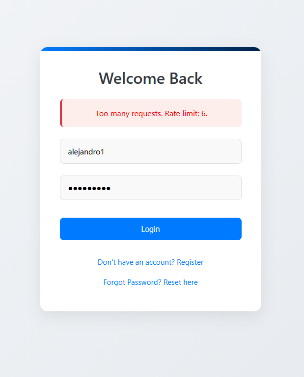
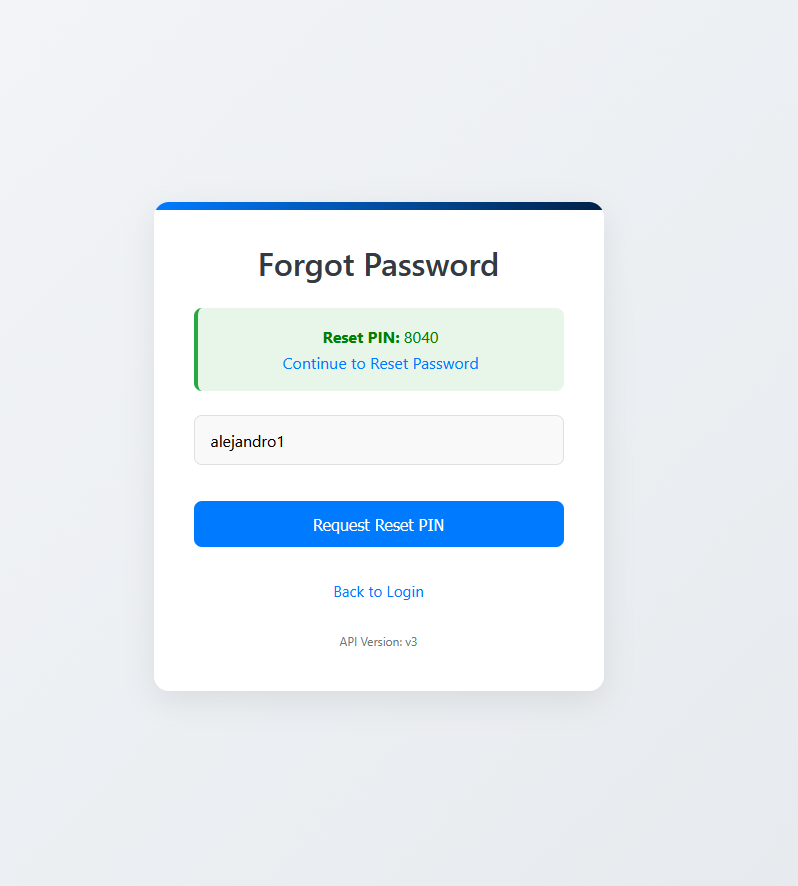
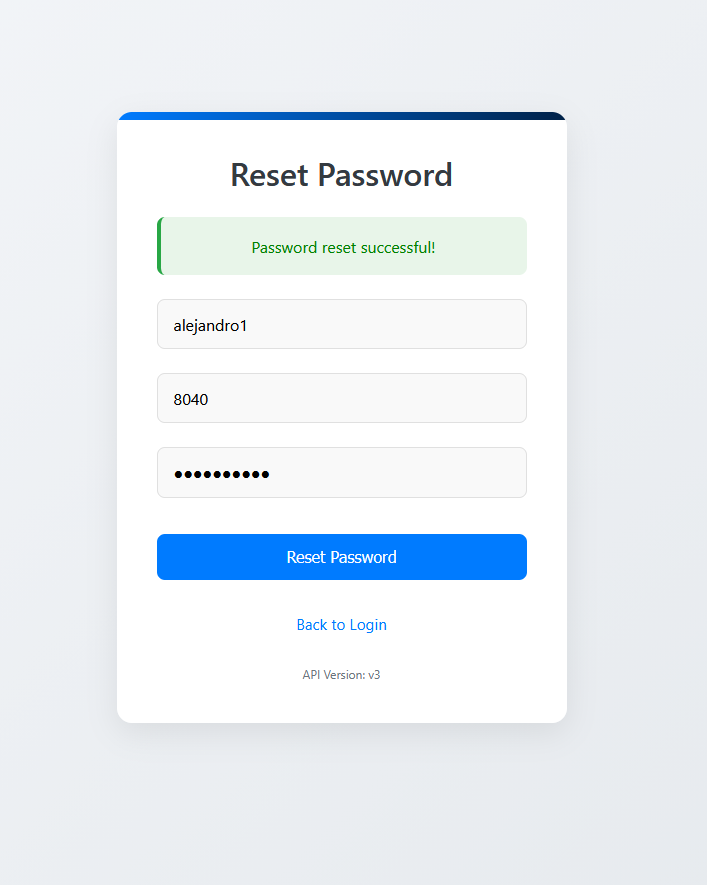
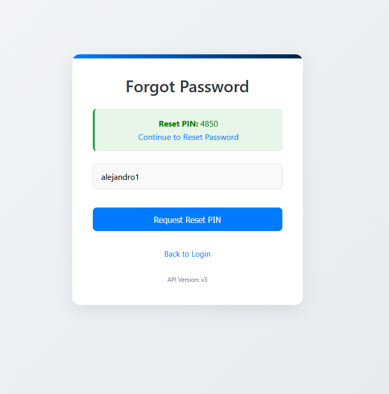
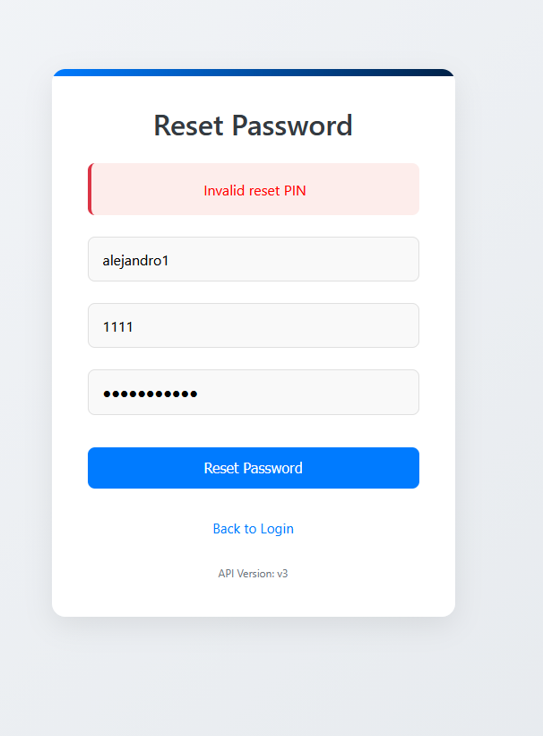
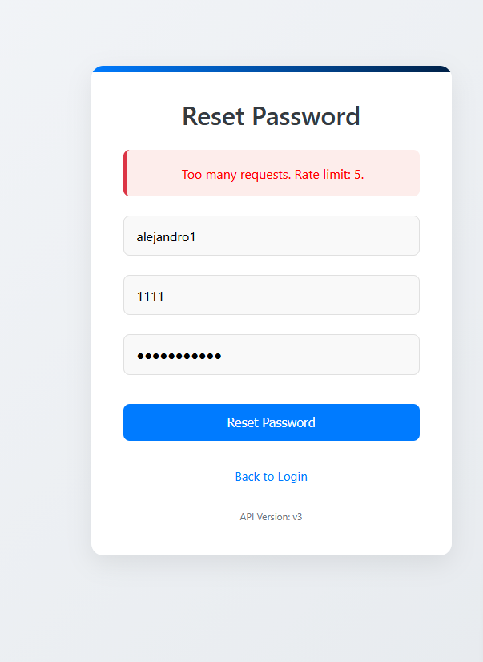
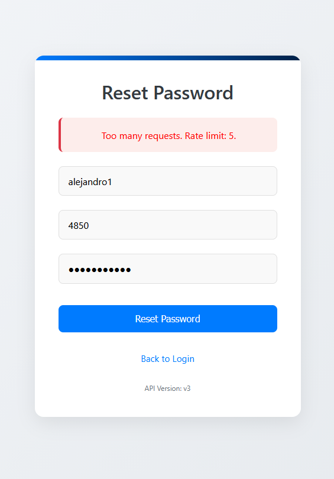

# Rate Limiting

Generally, rate limiting refer to how the traffic rate is controlled between servers. In this context, rate limiting is implemented to prevent clients from making a certain amount of requests in a set time period. There are different ways to exploit a lack of effective rate limiting, including brute-forcing login attempts and password resets. This can lead to compromised accounts and data. 

## Prerequisites

- Access the web app through a browser
- Access to a test account, which the user must create following the 'Register' path
    - Recommendations: keep details simple and do not lose them. 

## Login Rate Limiting (Vulnerable/Non-hardened)

To highlight this exploit, we will observe how a lack of rate limiting allows unlimited login attempts. In this context, although users know their own account's details, it is evident how trying to log into an unknown account leaves room for them to attempt to guess the unknown password as many times as desired. 

1) Confirm app is in vulnerable/non-hardened state (check toggle on homepage).
2) From the homepage, select Login.
3) With an incorrect password, try to log into the user's test account at least 10 times. 
4) Log in using the correct password successfully.

## Login Rate Limiting (Mitigation/Hardened)

To prevent the threat of a brute-force attack on login attempts, rate limiting can be implemented so that only a set number of login attempts are allowed before further requests are blocked, and users must wait until requests are once again allowed.

1) Confirm app is in hardened state (check toggle on homepage, cycle at least once).
2) From the homepage, select Login.
3) With an incorrect password, try to log into the user's test account at least 6 times.
4) Once a message appears noting that "Too many requests" were made, try logging on with the account's correct password.

Users can observe that even though they now have the correct password, due to the rate limit having been reached, users are blocked from logging in. 

## Reset Password Rate Limiting (Vulnerable/Non-hardened)

Similar to brute forcing login attempts, a lack of rate limiting on password resets reveals another vulnerability. It is possible to try a different combination of reset PINs until the correct one is found, which allows takeover of the account. 

1) Confirm app is in vulnerable/non-hardened state (check toggle on homepage).
2) Select Login, then navigate to "Forgot Password? Reset here" and select.
3) Enter account username and proceed.
4) The reset PIN appears. Copy this 4-digit PIN and select "Continue to Reset Password."
5) Enter the username, a new password, and an incorrect pin, at leat 10 times.
6) Now enter the correct, copied PIN from the previous screen, and observe the confirmation of the password change.

Note: For demo purposes, the correct 4-digit PIN is displayed on screen. Although this is not acceptable in normal instances, it makes this demo much quicker, which helps highlight how rate limiting is not implemented, and brute-force attacks are possible.

## Reset Password Rate Limiting (Mitigation/Hardened)

1) Confirm app is in hardened state (check toggle on homepage, cycle at least once).
2) Select Login, then navigate to "Forgot Password? Reset here" and select.
3) Enter account username and proceed.
4) The reset PIN appears. Copy this 4-digit PIN and select "Continue to Reset Passwordm"
5) Enter the username, a new password, and an incorrect pin, at leat 5 times.
6) Once a message appears noting "Too many requests," send in the password reset again, but this time with the correct PIN.

Users will observe that despite entering the correct PIN, rate limiting will have already blocked them, so they will be unable to reset the password for a set period of time.

