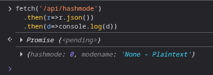
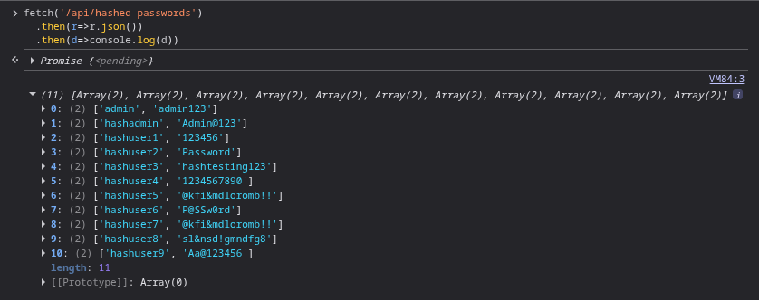
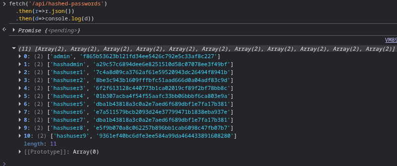
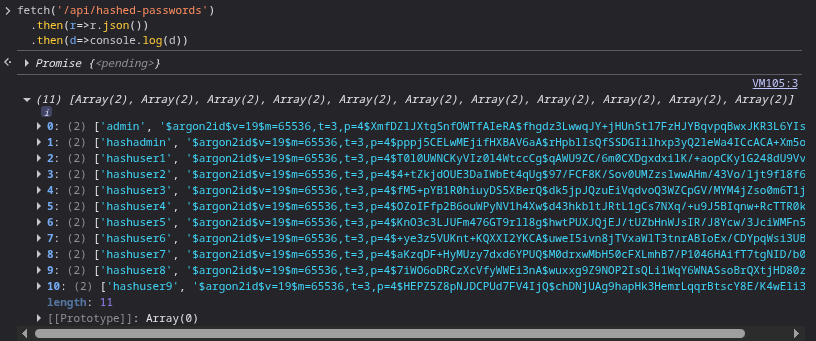
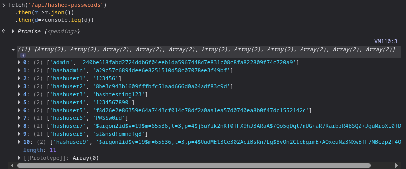

# Hashing Database With Algorithms of Varying Complexity

This app stores passwords in plaintext which is a vulnerability that can lead to a security breach. If an attacker gains access to the database, they have instant access to all user credentials. This README addresses the stretch goal of having a database of passwords hashed using different algorithms of varying complexity. Another team member will attempt to steal password hashes and break the cryptography.

## Prerequisites
- Access the web app through a browser

## Demonstrations
There is a hashing toggle with multiple hashing modes available. The hashing modes are:

- None: Plaintext
- Weak: SHA-1
- Medium: SHA-256
- Strong: Argon2id
- Various: Combination of all of the above

### View mode
1. The hashing mode is stated on the toggle button. It can also be viewed from the console window with this command:

`fetch('/api/hashmode')
.then(r=>r.json())
.then(d=>console.log(d))`

    

### Passwords Stored in Plaintext (No Hashing)
2. Set the toggle to 'Toggle Hashing: None'.
3. Open the browser console and put in the following command:

`fetch('/api/hashed-passwords')
.then(r=>r.json())
.then(d=>console.log(d))`

The usernames and passwords from the Users table will be visible.

### Passwords Hashed with SHA-1 (Weak Hashing)
4. Set the toggle to 'Toggle Hashing: Weak'.
5. Repeat step #3.

The usernames and passwords from the Users table will be visible.

### Passwords Hashed with SHA-256 (Medium Hashing)
6. Set the toggle to 'Toggle Hashing: Medium'.
7. Repeat step #3.

The usernames and passwords from the Users table will be visible.

### Passwords Hashed with Argon2id (Strong Hashing)
8. Set the toggle to 'Toggle Hashing: Strong'.
9. Repeat step #3.

The usernames and passwords from the Users table will be visible.

### Passwords Hashed with Multiple Algorithms (Various Hashing)
10. Set the toggle to 'Toggle Hashing: Various'.
11. Repeat step #3.

The usernames and passwords from the Users table will be visible.

