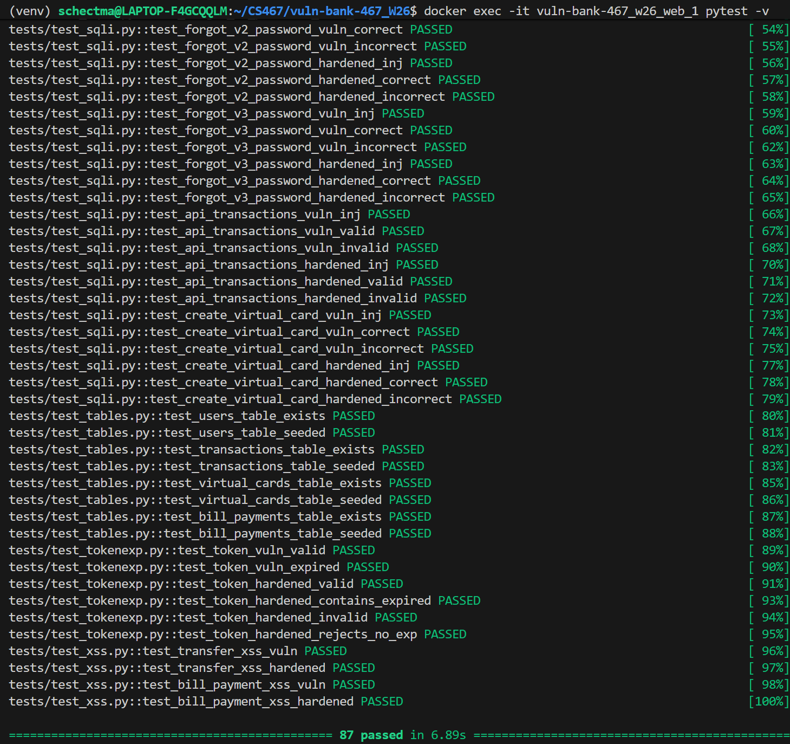

# Managing Tests

## Create
1. Create and/or check out a feature branch appropriate for the intended tests. 
2. Add a Python file to `./tests/` whose name is prepended with `test_`. E.g. `test_a.py`.
3. Populate file with `from helper import toggle_harden` on first line followed by any desired tests formatted to `pytest` standards.

## Run
Tests merged to a working branch in the GitHub repo will run automatically upon subsequent PR creations. They can be run locally by running the following CLI Docker commands in the working directory: 
1. `docker-compose -f docker-compose-test.yml down -v --remove-orphans`
2. `docker-compose -f docker-compose-test.yml up -d --build`
3. `docker exec -it <container_name> pytest -v`
The value of `<continer_name>` is usually `vuln-bank-467_w26_web_1`. Run `docker ps` to verify then paste/replace in above command if necessary.
