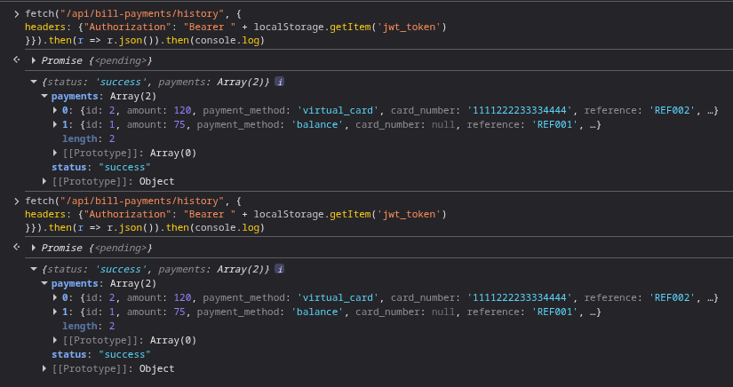
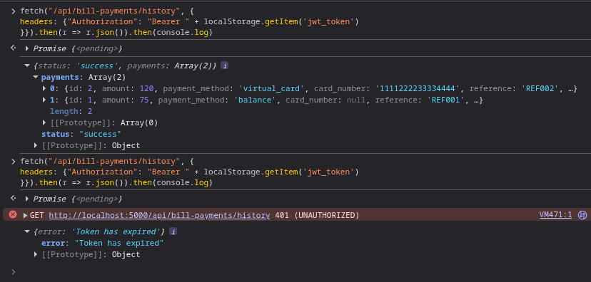

# No Session/Token Expiration
No session/token expiration means that the JWT token remains valid indefinitely. This is a large security risk if an attacker
acquires a token as it will never expire and can continue to be used. How long a token lasts varies on the application, but is frequently
less than 30 minutes for banks. In order to make it easier to demonstrate for this project, it has been set for 30 seconds for the mitigation.
## Prerequisites
Browser access to functioning web app and least one registered user account.
## Demonstrations
This vulnerability is present within auth.py. Steps for exploitation and verification of hardening are as follows.
#### Exploit
1. Login as any registered user.
From here, this may be exploited with the CLI.
##### via CLI
2. Open the browser console/terminal.
3. Issue the following fetch request as a command:
`fetch("/api/bill-payments/history", {
headers: {"Authorization": "Bearer " + localStorage.getItem('jwt_token')
}}).then(r => r.json()).then(console.log)`

4. Wait at least 30 seconds and paste in the same command.
5. See result:

    

#### Mitigate
Toggle vulnerabilities on.

6. Repeat the directions above. Token is now set to expire after 30 seconds.

7. See result:

